  <h3><code>PrafulChotia@github ~ $ ./contributions.sh</code></h3>
  

    

  <h3><code>PrafulChotia@github ~ $ whoami</code></h3>
  <table>
    <tr>
      <td valign="top"></td>
      <td valign="top"></td>
    </tr>
  </table>

    

  <h3><code>PrafulChotia@github ~ $ ./links.sh</code></h3>
  
<b>Developer | Python | Computer Vision</b>

  

    
  

